# Soldering and Gluing the Alia Blinky PCB

This guide walks you through two assembly steps: soldering the Seeed XIAO RP2040 microcontroller onto the Alia Blinky PCB, and gluing the prop and tail diffuser covers in place. Soldering is optional — the board also works with the microcontroller plugged in via socket headers — but soldering it down gives a more secure, permanent connection.

**Time:** ~20 minutes  
**Skill level:** Beginner-friendly

## What You Need

- Alia Blinky PCB
- Seeed XIAO RP2040 (or compatible board)
- 2× 7-pin male header strips (usually included with the XIAO)
- Soldering iron (300°C / 570°F)
- Solder (rosin-core recommended)
- Isopropyl alcohol (IPA) + cotton swabs for cleanup
- Flush cutters + safety glasses for trimming pins
- Kapton or masking tape (optional, helps hold the chip while soldering the back)

## Step 1: Get familiar with the PCB

Take a moment to look over the PCB. The center area is where the microcontroller mounts. The large circular pads are the prop LED pads; the gold traces connect everything together.

## Step 2: Inspect the PCB component side

The front side of the PCB has the small pre-soldered SMD components (capacitors, diodes, resistors) in the center. The two rows of through-holes flanking the center cutout are where the pin headers will go.

## Step 3: Gather your parts

You need the XIAO RP2040 and two 7-pin header strips. The headers typically come packaged with the XIAO — break them to length if needed.

## Step 4: Insert the pin headers

Insert the two pin header strips into the through-holes on the PCB (short pins down through the board, long pins up). **Tip:** resting the PCB on a roll of tape keeps it elevated so the pins don't get pushed back out while you work.

## Step 5: Pin headers seated

With both header strips inserted, you can see the two rows of pins ready to accept the microcontroller. The pre-soldered SMD components (D1, D4, D5, R5, R6, U1, U2) are visible in the center — these are already done for you.

## Step 6: Place the microcontroller — correct orientation

Place the XIAO onto the pin headers. **The USB-C port must face toward the tail of the aircraft** (the bottom of the PCB as shown). This is critical — the pin mapping only works in this orientation.

## Step 7: Wrong orientation — don't do this

**Do not** place the chip with the USB port pointing toward the nose. This is the wrong orientation — the pins will be reversed and the board won't work correctly.

## Step 8: Wrong orientation — don't do this either

**Do not** place the chip upside down (component side facing down). The chip label and FCC logo should be visible from the top.

## Step 9: Turn on the soldering iron

Power on your soldering iron and set it to **300°C (570°F)**. Allow it to fully heat up before starting — this usually takes 1–2 minutes.

## Step 10: Clean the tip

Before soldering, clean the iron tip by wiping it in the brass wool cleaner. A clean, shiny tip transfers heat much more effectively than a dirty or oxidized one. Re-tin the tip with a small amount of fresh solder after cleaning.

## Step 11: Double-check orientation before soldering

Before applying any solder, do a final orientation check. The USB-C port should be pointing toward the tail. Once you solder a pin it takes effort to undo, so confirm now.

## Step 12: Solder technique — one pin first

Place the iron tip at the intersection of the pin and the copper pad — touching both at the same time. Feed solder into that junction (not onto the iron itself) until it flows smoothly, then remove the solder, then remove the iron. **Start with just one pin** so you can verify everything is flat before committing to all the others.

## Step 13: Where to apply solder

Heat where the pin meets the copper pad. Add solder to the intersection of the pin and pad — not to the soldering iron. The solder should flow toward the heat and wick around the pin to form a cone shape.

## Step 14: What a good joint looks like

A good solder joint is **bright and smooth**, forming a neat cone around the pin. If it looks dull, lumpy, or balled up, it's a cold joint — reheat it until the solder flows and re-wets the pad.

## Step 15: Solder one full side

Once your first pin looks good and the chip is sitting flat, solder all the remaining pins on that side. Then do the other side. Check every joint — all should be bright and smooth.

## Step 16: Watch out for solder bridges (shorts)

Watch for **solder bridges** — blobs of solder connecting two adjacent pins together. If you see one, reheat the joint until the solder melts, then drag the iron tip away to pull the exces`s solder off. You can also use solder wick to absorb it.

## Step 17: Tape the chip and flip the board

Place a strip of tape over the chip to hold it in place, then carefully flip the board over. The pin tips will now be sticking up through the back of the PCB, ready to solder.

## Step 18: Back side — pins ready to solder

From the back you can see the two rows of pin tips coming through the board. These are what you'll solder to secure the connection from this side.

## Step 19: Back side — solder one pin first

Same technique as the front: start with just one corner pin. Solder it, then check that the chip is still sitting flat against the PCB before continuing.

## Step 20: Check flatness, then solder the opposite corner

Once the first pin is done and the chip is confirmed flat, solder the diagonally opposite corner pin. These two anchors hold the chip securely in position while you finish all the remaining pins.

## Step 21: Watch out for cold joints

**Cold joints** look dull, grainy, or like a ball sitting on the pad rather than flowing into it. They indicate the solder didn't reach proper temperature and may not make a good electrical connection. Re-melt any cold joints and let them re-flow properly.

## Step 22: Finish all back pins

Solder all remaining pins on the back side. All joints should be smooth and bright. Don't worry about the amber/brown flux residue — that's normal and harmless, and you'll clean it off next.

## Step 23: Clean off the flux

Dip a cotton swab in isopropyl alcohol (IPA, 90%+) and scrub away the flux residue. The board will look much cleaner and it's easier to inspect your joints afterwards.

## Step 24: Trim the protruding pins

Use flush cutters to trim the pin tips down close to the solder joints. **Always wear safety glasses for this step** — the clipped pin ends can fly off at speed and cause eye injury.

## Step 25: Done!

Congratulations — you're done! The back of the board should show two neat rows of short, trimmed, bright solder joints. Plug in your USB-C cable, upload the firmware, and enjoy the light show.

## Troubleshooting

**LEDs don't light up at all**
- Check the serial monitor (115200 baud) — the board should print startup info on boot
- Verify the USB port is toward the tail (correct orientation)
- Inspect all solder joints under good lighting — look for any that are dull or bridged

**Some LEDs are dim or wrong color**
- Usually a cold joint on one of the data pins — reflow any suspect joints

**Board won't enumerate as USB device**
- Check for a solder bridge on the pins nearest the USB connector
- Try holding the BOOT button while plugging in to enter bootloader mode

See [TUTORIAL.md](TUTORIAL.md) for full firmware setup instructions.

# Part 2: Gluing the Prop and Tail Diffuser Covers

Once the electronics are working, glue the white diffuser covers over the prop LED rings and the tail LED strip. These soften and spread the LED light for a realistic look.

**Time:** ~15 minutes  
**Skill level:** Beginner-friendly

## What You Need

- 4 prop diffuser covers (round, white) + 1 tail diffuser cover (oval, white)
- Super glue (cyanoacrylate — Bob Smith Industries Maxi-Cure or similar extra-thick CA glue recommended)
- CA glue accelerator spray (e.g., eRockets INSTA-SET)
- Paper towel to work on — glue will bond to your table!

> **Safety:** CA glue bonds skin instantly. Keep it off your fingers and away from your eyes. Work in a ventilated area.

## Step 1: Locate the diffuser covers

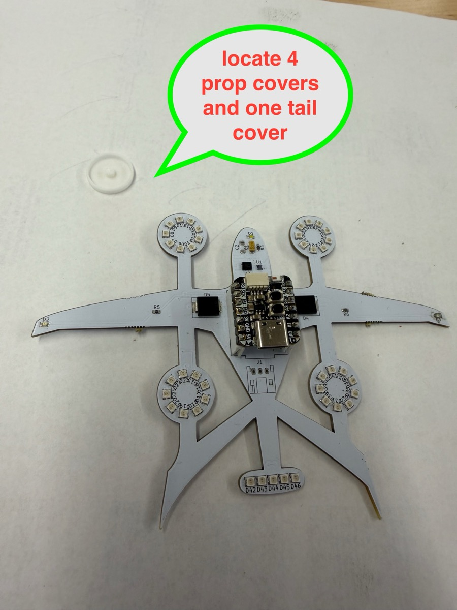

You should have 4 round prop covers and 1 oval tail cover. The round covers go over each of the 4 prop LED rings; the oval cover goes over the tail LED strip at the bottom of the PCB.

## Step 2: Get your CA glue accelerator

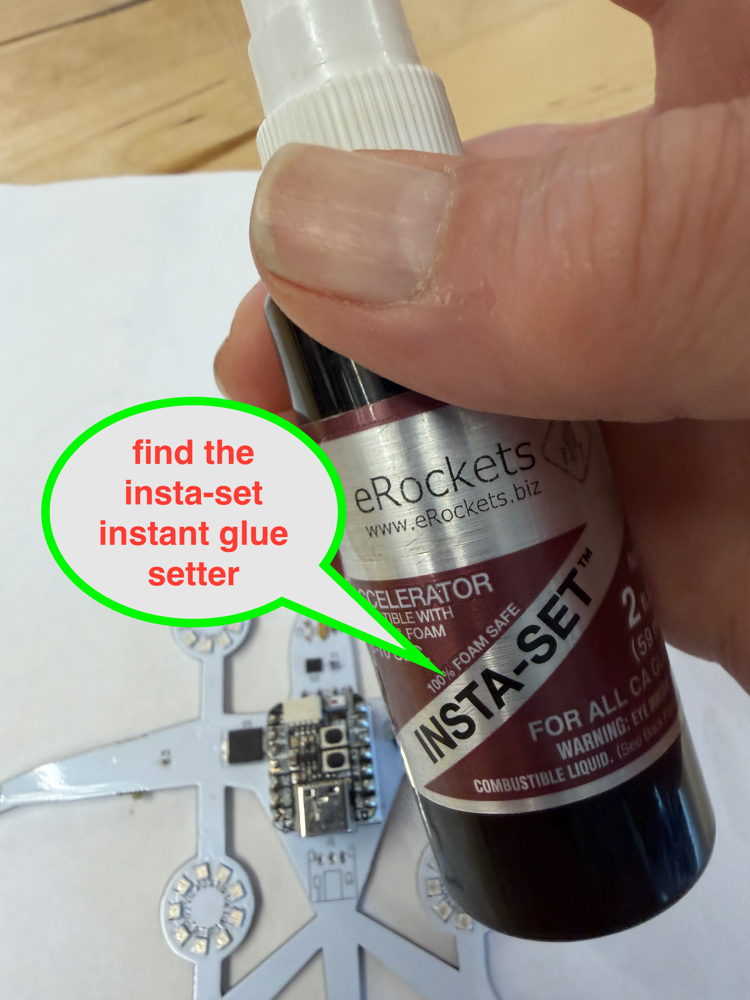

Find your CA glue accelerator (INSTA-SET or equivalent). This spray is applied to the PCB first — it causes the CA glue on the cover to set almost instantly on contact, so you get a fast, strong bond without waiting.

## Step 3: Spray the prop and tail locations

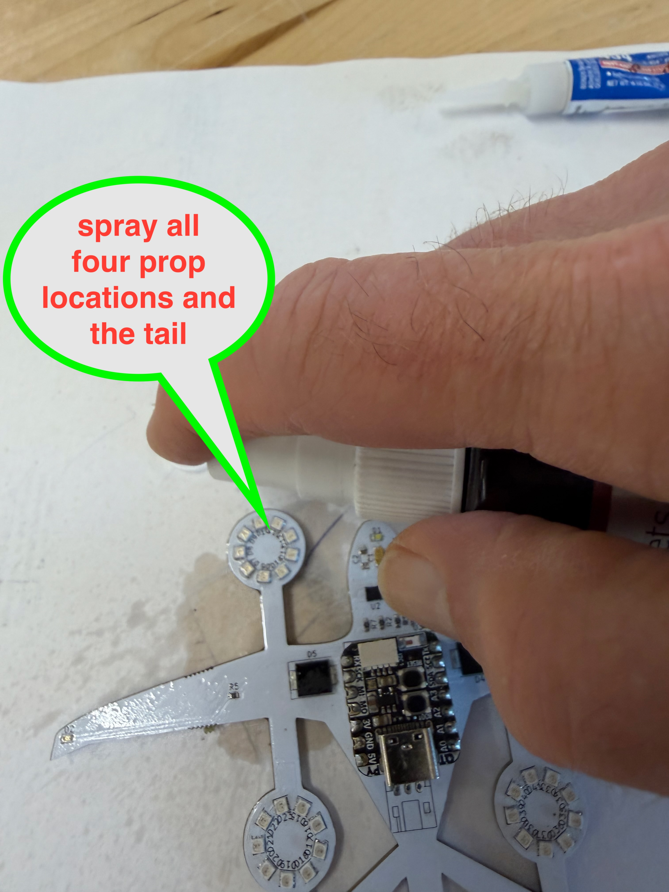

Lightly spray the accelerator onto all four prop LED ring locations and the tail LED location. You don't need a lot — a quick mist is enough. Let it sit for a few seconds.

## Step 4: Get your super glue

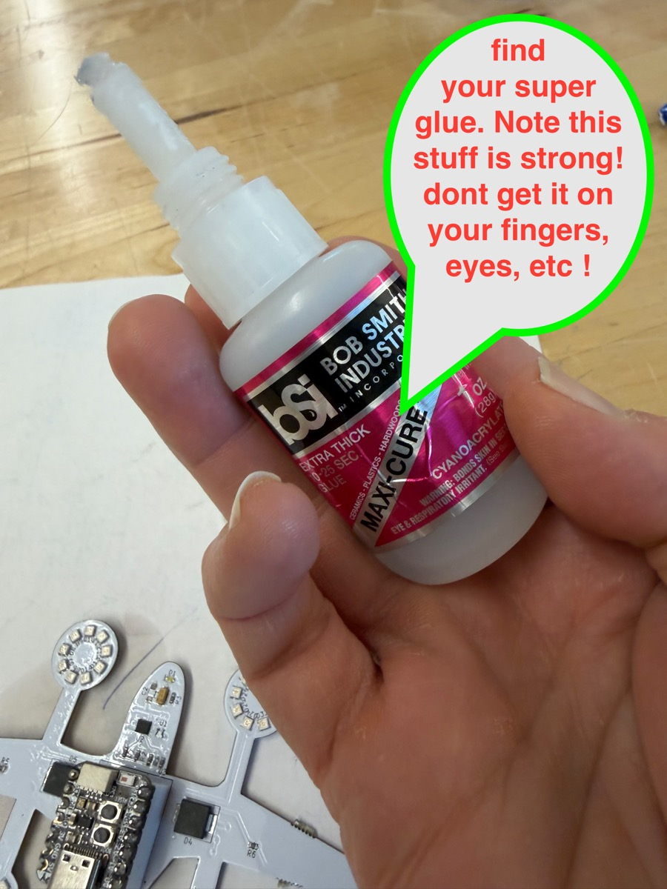

Find your super glue. Extra-thick CA glue (like BSI Maxi-Cure) works best here — it's viscous enough to stay put when you apply it to the cover. **This stuff is very strong — don't get it on your fingers or eyes.**

## Step 5: Apply glue to the prop cover posts

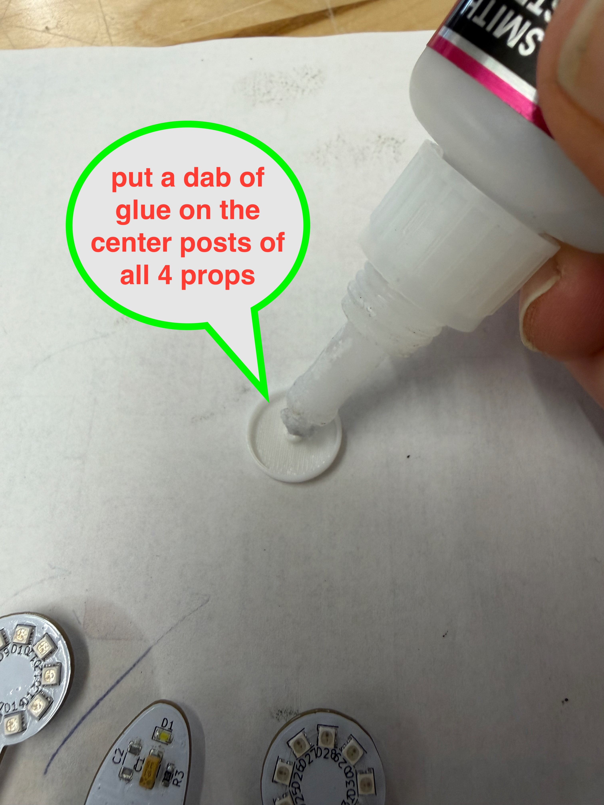

Put a small dab of super glue on the center post (nub) on the underside of each prop cover. Do all 4 prop covers. You only need a small amount — CA glue is very strong and a little goes a long way.

## Step 6: Place each prop cover onto the PCB

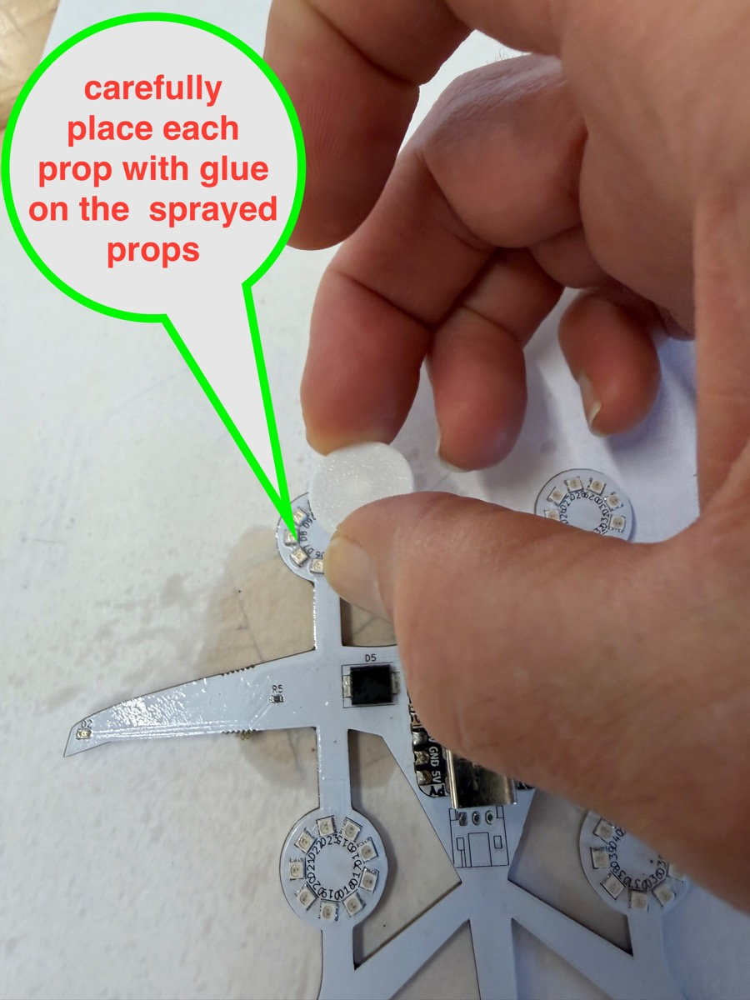

Carefully lower each prop cover, glue-side down, onto its matching LED ring on the PCB. The center post should align with the center hole in the LED ring. The accelerator on the PCB will trigger the glue to set on contact.

## Step 7: Press down for 15 seconds

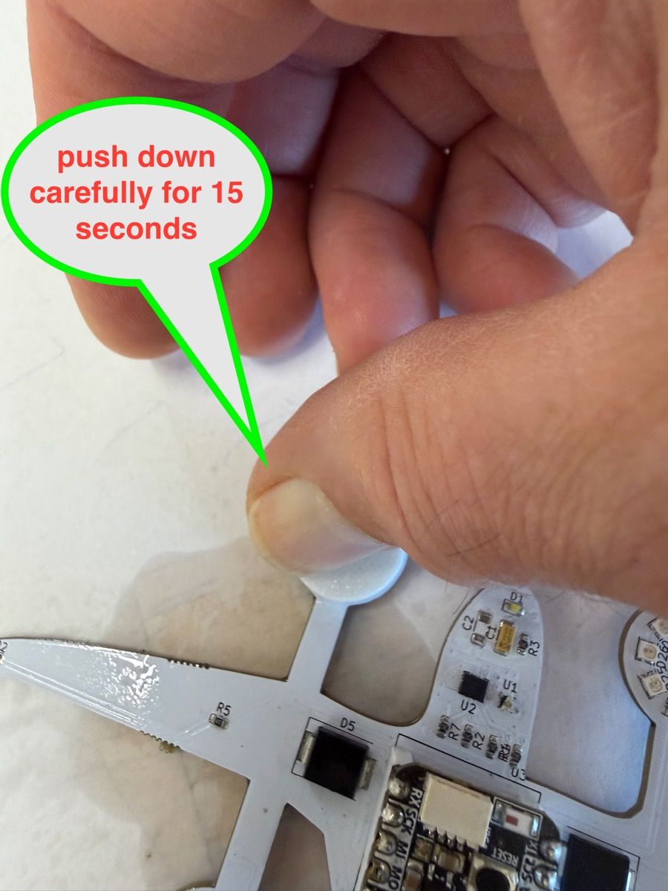

Press each cover down firmly for about 15 seconds to ensure full contact and a strong bond. The CA glue + accelerator combination sets fast, but holding it longer ensures a solid joint.

## Step 8: Check your work

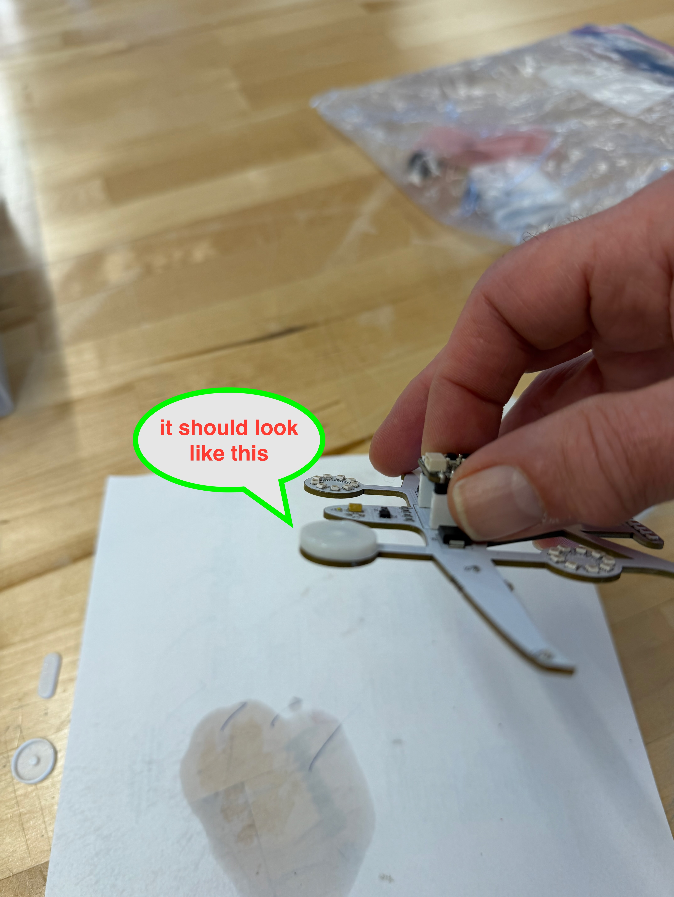

After attaching all 4 prop covers, it should look like this — covers sitting flat and flush on each LED ring. If a cover feels loose, apply a small drop of CA glue around the edge and press again.

## Step 9: Apply glue to the tail diffuser edge

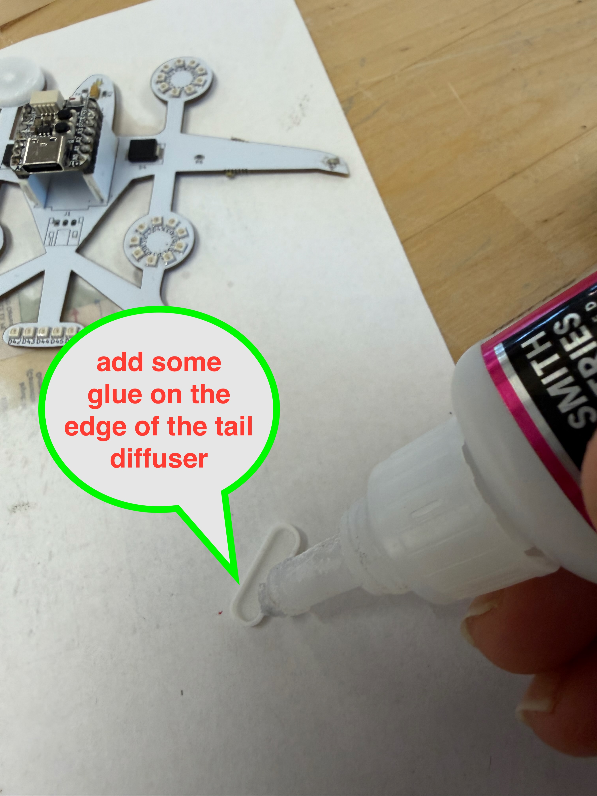

Apply a thin bead of super glue around the edge of the tail diffuser cover (the oval piece). This cover sits over the tail LED strip rather than having a center post, so edge gluing is the method here.

## Step 10: Spray the tail location and press the cover down

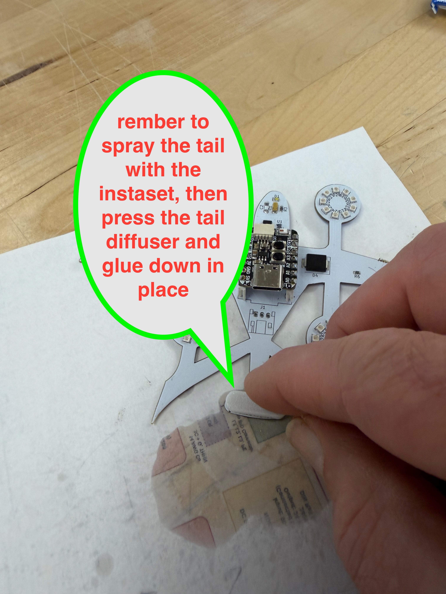

Spray the tail LED location on the PCB with accelerator, then immediately press the tail diffuser — glue edge down — onto the tail area. The glue will set on contact with the accelerator.

## Step 11: Hold for 15 seconds

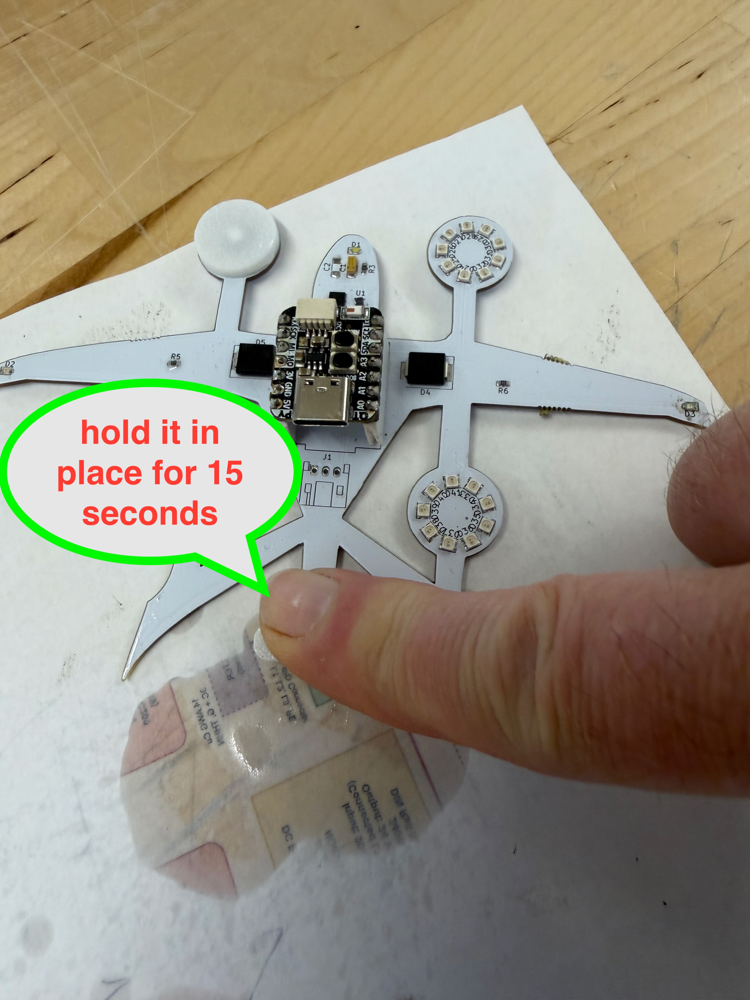

Hold the tail diffuser firmly in place for 15 seconds. Once set, the PCB assembly is complete — all 4 prop covers and the tail cover should be solidly bonded.

All done! Your Alia Blinky PCB is fully assembled and ready to install in the model.
